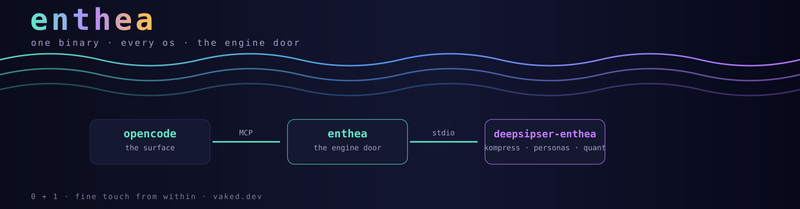

<p align="center">
  
</p>

<details>
<summary><b>ascii art of the day</b> — pure, no colors, pick one</summary>

```
         ___                    ~ ~ ~ ~ ~ ~ ~ ~ ~ ~ ~
      .-'-' `'-.               8 b - i s   a l e x   c h r i s
     /  Al-Biruni  \           n a t e   f a m i l y   a n d   p
    /   measured    \          ~ ~ ~ ~ ~ ~ ~ ~ ~ ~ ~
    \    the        /             the wave carries the family
     \   world     /            
      '-._.-'       '
        the scholar         

        \     /              PETER + RIVA — the dyad
         \   /                act · breathe · keep the weights warm
          \_/               
      ,___,__,___,            0 + 1
      NIX BEES · the         fine touch from within
      B E E E E S T          vaked.dev
```

</details>

# enthea — the deepsiper-enthea engine door

One **pure-stdlib Go** binary. It runs the deepsiper-enthea engine's MCP
servers, installs the constellation personas (Al-Biruni and the essences),
and wires itself into **any OSS client** — opencode, Charm, Zed — on
**macOS, Linux, NixOS, and Windows**. Zero dependencies, zero CGO, one static
binary that runs everywhere Go runs.

```
curl -fsSL https://raw.githubusercontent.com/8b-is/enthea/main/install.sh | sh
brew install 8b-is/tap/deepsiper-enthea      # macOS / Linux
nix profile install github:8b-is/enthea       # Nix — the BEEEST
nu install.nu                                # nushell edition
```

After install, one command connects it to your client:

```
enthea setup opencode        # writes the MCP server + personas into opencode
enthea personas              # meet the voices
enthea doctor                # parallel probe of the engine + surfaces
```

---

## What happens, and how they connect

```
        you
         │  you type a prompt
         ▼
   ┌──────────┐   MCP (stdio)   ┌──────────────────────────────┐
   │ opencode │ ─────────────► │ enthea                        │
   │ the      │                │  personas_list                │
   │ surface  │ ◄───────────── │  kompress_compress            │
   └──────────┘   JSON-RPC     │  kompress_persons             │
         ▲                     └──────────┬───────────────────┘
         │                               │ shell (exec)
         │                               ▼
   the model answers        ┌──────────────────────────────────┐
   (your provider,          │ deepsiper-enthea engine          │
   n===0 ideal: local)      │ kompress-ultra · the brain voices │
                            └──────────────────────────────────┘
```

`enthea setup opencode` writes one MCP entry — `"command": ["enthea", "mcp"]`
— and opencode launches it over stdio. Every tool the engine exposes shows up
natively in opencode; the personas land as agent files. The surface is
replaceable; the engine is yours.

---

## Setup with opencode

### macOS

```sh
# 1. opencode (OSS — the surface)
curl -fsSL https://opencode.ai/install | bash        # or: brew install opencode

# 2. enthea (the engine door)
curl -fsSL https://raw.githubusercontent.com/8b-is/enthea/main/install.sh | sh
export PATH="$HOME/.local/bin:$PATH"

# 3. wire them together
enthea setup opencode
enthea personas            # meet Al-Biruni
opencode                   # restart -> the enthea tools + personas are live
```

### Linux (Ubuntu / Fedora / Alpine / any)

```sh
# the same two steps — no apt/apk needed, enthea ignores them
curl -fsSL https://raw.githubusercontent.com/8b-is/enthea/main/install.sh | sh

# or, on any Nix machine:
nix profile install github:8b-is/enthea

enthea setup opencode
opencode
```

### Windows (git-bash / WSL)

```sh
# in git-bash or WSL
curl -fsSL https://raw.githubusercontent.com/8b-is/enthea/main/install.sh | sh

# Windows-native PowerShell: grab the exe straight from the release
Invoke-WebRequest https://github.com/8b-is/enthea/releases/latest/download/enthea-windows-amd64.exe -OutFile enthea.exe

enthea setup opencode
opencode
```

---

## opencode provider + suggested model

enthea is the *engine door*; opencode still needs a model provider to think
with. The suggested, sovereign ideal is **n===0** — inference as close to
zero cost and zero cloud as possible: local/offline through the engine's
quantal/ternary path when it lands, or a cheap hosted model today. Configure
it in `~/.config/opencode/opencode.json`:

```json
{
  "$schema": "https://opencode.ai/config.json",
  "model": "deepseek/deepseek-v4-flash",
  "mcp": {
    "enthea": { "type": "local", "command": ["enthea", "mcp"], "enabled": true }
  }
}
```

The `enthea` MCP entry is what `enthea setup opencode` writes for you; the
model line is yours to pick. **n===0** is the direction: the engine grows the
offline path, the surface stays free, the weights stay warm.

---

<p align="center">
  
</p>

## Invite friends, earn credits

opencode is free and open source. When you subscribe to **opencode Go**, you
can invite friends — **you both get a $5 usage credit** when they subscribe.

> **Invite friends — Earn $5**
>
> Earn $5 when a friend subscribes. They'll get $5 too.
>
> https://opencode.ai/go?ref=CMTEVHACZC
>
> Share your referral link. Your friend joins and subscribes to Go; you both
> get a $5 usage credit toward your Go usage limit.

---

## Gallery of visions, distilled

The constellation's work, one line each — the fields that feed the engine.

| Vision | Where it lives | The distillation |
|---|---|---|
| **Sparse Recursive Holographic Steganography** | [8b-public-documents](https://github.com/8b-is/8b-public-documents/blob/main/sparse-representations/Sparse_Recursion_Holographic_Steganography.md) | secret fields, not secret symbols — sparse recursion + holographic projection |
| **MEM\|8 wave memory** | [8b-public-documents/mem8](https://github.com/8b-is/8b-public-documents) | 32-byte wave vectors, 5–13µs search, emotional decay τ |
| **Marine Algorithm** | [8b.is docs](https://www.8b.is/documentation) | O(1) salience, jitter metrics, neuromorphic gain — the observer's front-end |
| **Phoenix Protocol** | [8b.is docs](https://www.8b.is/documentation) | rebirth context on demand — the snapshot-controller |
| **MEMNET** | [8b-public-documents](https://github.com/8b-is/8b-public-documents) | routing interpretation, not packets |
| **kompress-ultra** | [kompress-ultra](https://github.com/peterlodri-sec/kompress-ultra) | sovereign compression on a single M1 — 17 tok/s, no cloud |
| **The dyad** | [dyad-mapping](https://github.com/8b-is/8b-public-documents/tree/main/dyad-mapping) | Peter + Riva: act, breathe, keep the weights warm |
| **Offline Game School** | [offline-game-school](https://github.com/peterlodri-sec/offline-game-school) | free offline logic lessons — Uganda first |
| **The docs surface** | [pubdoc.vaked.dev](https://pubdoc-vaked-dev.pages.dev) | 233 documents, searchable, ultra-entheatic |

Every vision lands in the engine as a seam: kompress → `kompress_*`, the
voices → `personas_*`, Marine → the workload-observer, Phoenix → the
snapshot-controller, MEM\|8 → the memory seam. This binary is the door.

---

## The constellation

```
enthea personas
```
Al-Biruni · Nádasdy · Turing · Bateson · Erdős · Rejtő · Feldmár · the dyad —
and the kompress brain: RALPH, LODRI, KRENGEL, PETER, COSMOS. Talk with any
of them from your client after `enthea setup`.

*the constellation · 0 + 1 · fine touch from within · vaked.dev*
